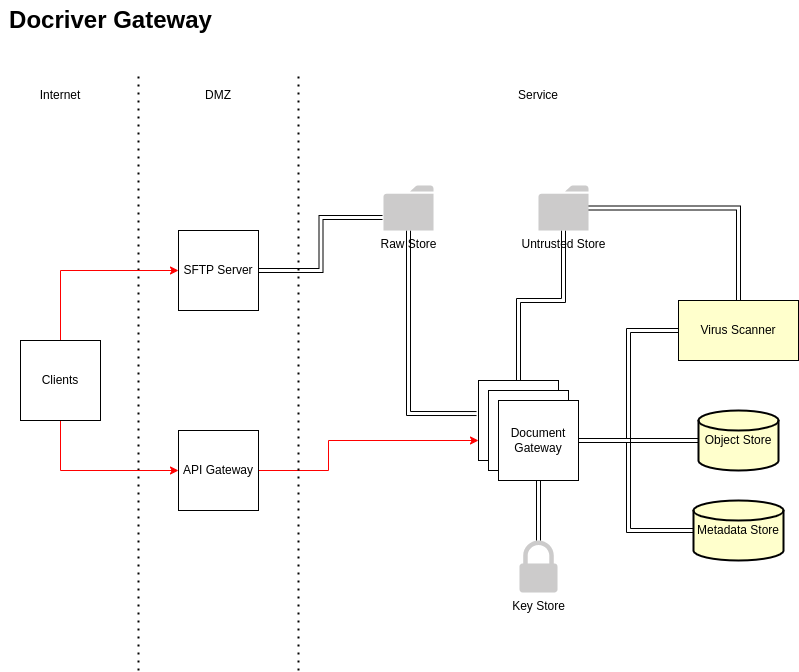

## Introduction
This docriver-gateway repository is part of the Docriver project. 

Docriver is an initiative to create a highly-scalable document ingestion and processing system for use by large enterprises and service providers. Documents include various forms of text files (XML, plaintext, etc), and binary fies (images, videos, audio, pdf, msword, xls, etc.). As we are increasing the use of documents for building solutions, we need services to ingest documents safely and securely from "untrusted" sources on the Internet and run them through processing pipelines in order to extract useful the information we need for our applications.

This repository contains source code for the ingestion subsystem. The function of the gateway is to receive documents from extrnal and internal entities, sanitize them and store them from downstream processing. The components include:

- Endpoints for receiving documents from clients
- An object storage for storing documents
- A database for storing document metadata
- A virus scanner for validating that the received documents does not contain any harmful content
- Filesystem volumes to store files during the ingestion process
- The gateway application that processes document ingestion requests. The document ingestion process includes:
    - Authorization
    - Document valiation
    - Document and Metadata storage.

